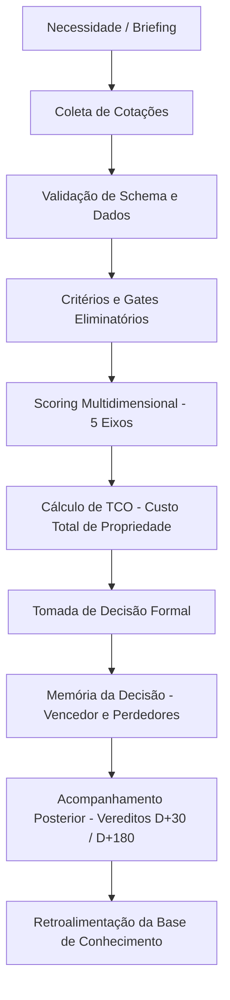
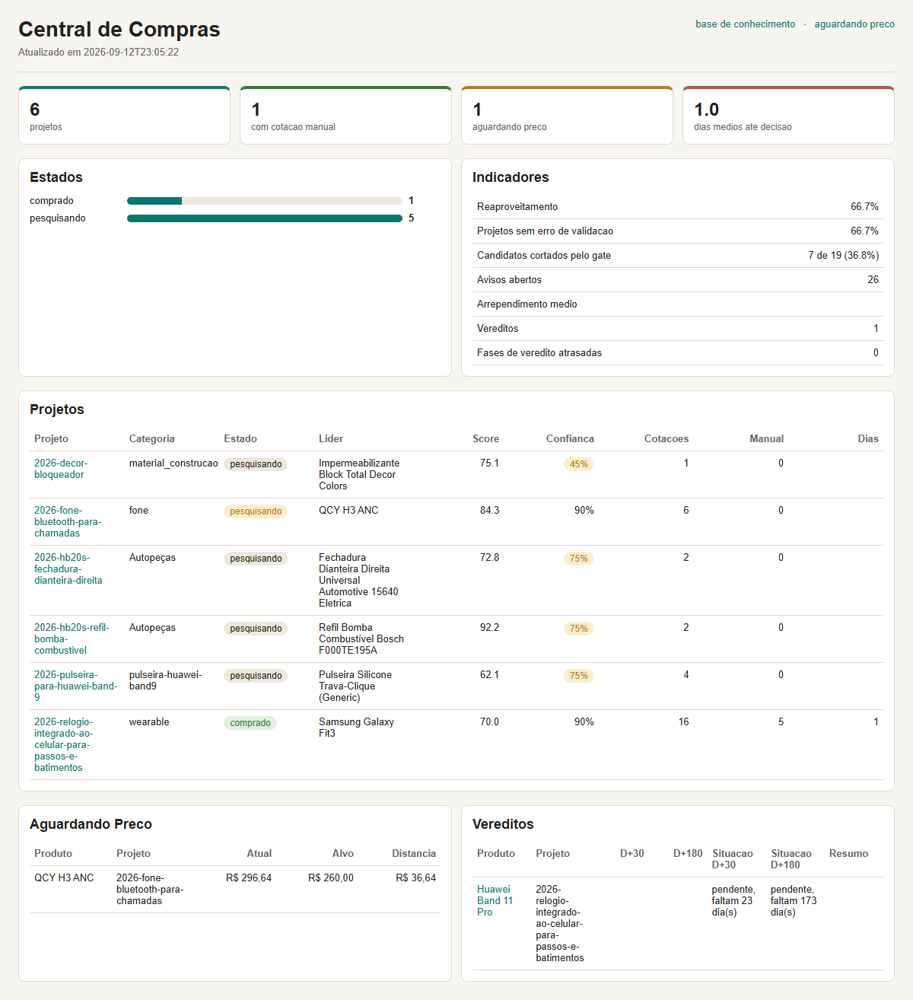
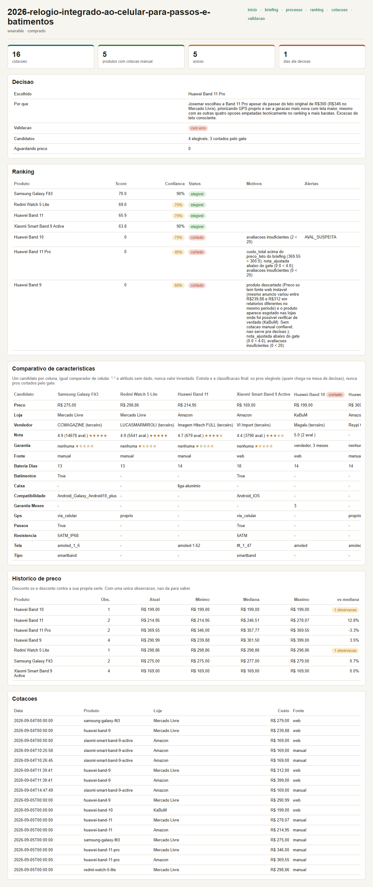

# Central de Compras

Sistema estruturado para gestão de compras, governança de processos e tomada de decisão com rastreabilidade completa e cálculo de TCO (*Total Cost of Ownership*).

---

## Visão Geral

A **Central de Compras** é uma solução desenvolvida para transformar decisões de compra — pessoais ou operacionais — em processos auditáveis, estruturados e baseados em evidências técnicas e financeiras.

Em decisões de aquisição tradicionais, o preço costuma ser o único critério observado e se torna obsoleto rapidamente. Já a justificativa da escolha, os trade-offs considerados, os produtos eliminados e as lições aprendidas costumam se perder. Este sistema estabelece um processo em que cada compra possui histórico completo: desde a definição de requisitos até a avaliação pós-compra (D+30 e D+180).

---

## O Problema

- **Decisões impulsivas ou baseadas apenas em preço inicial:** desconsideração de custos operacionais, depreciação e manutenção (TCO).
- **Perda da memória de decisão:** falta de registro de quais candidatos foram analisados, por que foram descartados e quais requisitos técnicos motivaram a compra.
- **Dificuldade de auditoria:** processos sem rastreabilidade de fontes, prazos, garantias e cotações.
- **Inexistência de ciclo de aprendizado pós-aquisição:** ausência de acompanhamento sobre arrependimento, quebra de expectativas ou satisfação com fornecedores e marcas.

---

## A Solução

Um fluxo metódico e automatizado que orquestra todo o ciclo de vida da compra:
1. **Definição de requisitos e briefing técnico.**
2. **Coleta de cotações com proveniência e rastreabilidade.**
3. **Filtros eliminatórios (*gates*) e pontuação ponderada em 5 eixos.**
4. **Cálculo de TCO** para itens de maior impacto financeiro.
5. **Registro formal da decisão** (vencedor, justificativa e motivo da derrota dos concorrentes).
6. **Avaliação pós-compra (D+30 e D+180)** para retroalimentar a base de conhecimento de lojas e marcas.
7. **Dashboard visual local** para acompanhamento em tempo real do status das cotações e indicadores.

---

## Para Quem Serve

- Gestores de processos e operações que precisam de critérios objetivos de aquisição.
- Pequenos negócios e profissionais que buscam governança nas compras operacionais.
- Indivíduos que desejam aplicar rigor técnico, governança pessoal e redução de desperdício em aquisições de médio e alto valor.

---

## Fluxo de Decisão

O ciclo de uma compra segue etapas bem delimitadas com validações contínuas:



---

## Critérios Utilizados e Modelo de Scoring

O motor de decisão avalia cada cotação em 5 eixos fundamentais (pontuação de 0 a 100):

| Eixo | Peso Padrão | O que mede |
|---|:---:|---|
| **Qualidade** | 25% | Avaliações consolidadas, reputação técnica e notas de usuários. |
| **Risco** | 20% | Confiabilidade da loja/vendedor, tipo de garantia e histórico na base. |
| **Conveniência** | 15% | Prazo de entrega, custo de frete e facilidade de devolução/troca. |
| **Valor** | 25% | Relação de preço comparativa com os concorrentes ou TCO projetado. |
| **Aderência** | 15% | Compatibilidade estrita com os requisitos definidos no briefing. |

### Cálculo de TCO (*Total Cost of Ownership*)
Para categorias de bens duráveis (veículos, equipamentos de TI, maquinário), o preço de compra inicial é apenas uma fração do custo total. O sistema calcula:

$$\text{TCO} = \text{Preço de Aquisição} + (\text{Custo Operacional Mensal} \times \text{Meses}) - \text{Valor Residual Projetado}$$

---

## Governança e Rastreabilidade

- **Append-only para cotações:** histórico imutável das ofertas observadas no tempo.
- **Portões eliminatórios (*Gates*):** candidatos que violam requisitos obrigatórios (ex.: ultrapassam preço teto ou não possuem garantia nacional) são cortados antes do ranking.
- **Memória formal:** o documento de decisão registra explicitamente quem venceu, por qual motivo técnico e por que cada perdedor foi preterido.
- **Vereditos D+30 e D+180:** fecham o ciclo avaliando índice de arrependimento e durabilidade, alimentando pontuações de lojas e marcas para compras futuras.

---

## Demonstração e Visualizações

O sistema inclui interface analítica gerada estaticamente para acompanhamento de todos os processos:

### Painel Geral de Governança
Visão consolidada de projetos, indicadores de corte por gates, cotações ativas e vereditos pendentes:



### Rastreabilidade do Projeto e Detalhe da Decisão
Detalhamento de pontuação por candidato, histórico de cotações e justificativa auditada:



---

## Exemplo Prático de Decisão (Dados Fictícios)

**Projeto:** `2026-headphone-trabalho`  
**Objetivo:** Aquisição de fone com cancelamento ativo de ruído (ANC) para reuniões diárias.  
**Preço Teto Definido:** R$ 500,00  
**Requisitos Obrigatórios:** Conexão multiponto, microfone com redução de ruído, garantia nacional.

| Candidato | Preço | ANC | Garantia | Score Final | Status | Motivo |
|---|:---:|:---:|:---:|:---:|:---:|---|
| **Modelo Alpha ANC** | R$ 329,00 | Sim | 12 meses | **86.4** | **Vencedor** | Melhor relação entre qualidade de microfone, garantia nacional e conformidade com o teto. |
| **Modelo Beta Pro** | R$ 580,00 | Sim | 24 meses | — | **Cortado no Gate** | Excedeu o preço teto estabelecido no briefing. |
| **Modelo Gamma Lite** | R$ 199,00 | Não | 3 meses | 54.1 | **Descartado** | Não possui cancelamento de ruído ativo obrigatório e garantia reduzida. |

**Registro da Memória:** O Modelo Alpha ANC foi selecionado com nota de arrependimento projetada baixa; o segundo colocado legítimo ficou R$ 70 acima sem ganho proporcional de microfone.

---

## Arquitetura e Tecnologias

- **Linguagem:** Python 3 (arquitetura modular com tipagem e validação de schemas).
- **Estrutura de Dados:** Arquivos declarativos em YAML e CSV (rastreabilidade compatível com Git).
- **Relatórios:** Motor de geração de dashboards em HTML/CSS sem dependências externas pesadas.
- **Integração:** Módulo de sincronização opcional com Google Sheets para visualização colaborativa.
- **Testes:** Suíte de testes automatizados com Pytest cobrindo integridade de dados, regras de pontuação, invariantes e CLI.

```
central-compras/
├── config/             # Configurações de categorias, pesos e regras de TCO
├── dashboard/          # Painel estático HTML/CSS gerado localmente
├── docs/               # Guias de uso, screenshots e documentação de arquitetura
├── produtos/           # Catálogo versionado de especificações técnicas
├── projetos/           # Pastas de compras (briefing, cotações, ranking, decisão)
├── scripts/            # CLI central_compras.py e módulos de domínio
├── tests/              # Mais de 570 testes unitários e de integração
└── vereditos/          # Avaliações pós-compra (D+30 e D+180)
```

---

## Como Executar Localmente

### Pré-requisitos
- Python 3.10 ou superior.

### Instalação
```bash
git clone https://github.com/josemardp/central-compras.git
cd central-compras
pip install -r requirements.txt
```

### Execução dos Testes
Para rodar a suíte completa de testes automatizados:
```bash
python -m pytest
```
*(Mais de 570 testes cobrindo invariantes de cálculo, validações de schema e fluxo da CLI).*

### Comandos Principais da CLI
```bash
# Inicializar o ambiente e schemas
python scripts/central_compras.py init

# Criar um novo projeto de compra
python scripts/central_compras.py novo-projeto "Headphone para trabalho" --categoria fone --valor-estimado 350 --preco-teto 500

# Adicionar cotação
python scripts/central_compras.py cotar projetos/2026-headphone-para-trabalho --produto-id modelo-alpha --loja "Amazon" --preco 329 --frete 0 --nota 4.6 --avaliacoes 1200 --garantia-meses 12 --garantia-tipo nacional

# Calcular ranking multidimensional
python scripts/central_compras.py ranking projetos/2026-headphone-para-trabalho

# Gerar o painel HTML atualizado
python scripts/central_compras.py dashboard
```

---

## Segurança e Privacidade

- **Operação 100% Local:** Todos os dados de cotação e especificações residem em arquivos locais no repositório.
- **Sanitização de Dados:** O repositório não contém senhas, tokens de API, informações financeiras confidenciais ou dados pessoais de terceiros.
- **Tokens Externos:** Configurações de integração externa (como tokens de planilhas) são lidas exclusivamente de arquivos de configuração locais e ignorados pelo Git (`.gitignore`).

---

## Sobre o Desenvolvimento

Este projeto foi desenvolvido como uma iniciativa pessoal e laboratório prático de aprendizagem em **gestão de processos, governança e automação**, com foco na tomada de decisão fundamentada em dados. 

O código foi desenvolvido com **assistência intensiva de ferramentas de Inteligência Artificial**, atuando na geração, refatoração de código e estruturação de testes. A definição dos requisitos de negócio, arquitetura dos fluxos, critérios de ponderação (scoring/TCO), validação dos resultados e governança do projeto foram integralmente concebidos e liderados pelo autor.

---

## Status do Projeto

- **Fase:** Funcional e estável para uso local.
- **Cobertura de Testes:** Mais de 570 testes automatizados passando.
- **Governança:** Motor de cálculo e auditoria em conformidade com os princípios de transparência de decisão.
