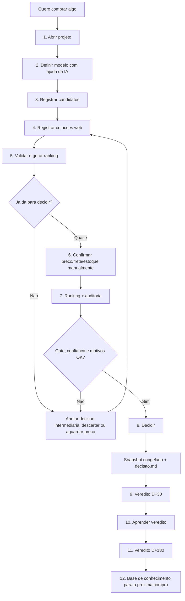

# Guia pratico visual da Central de Compras

Versao interativa para abrir no navegador:
[`guia-pratico-visual.html`](guia-pratico-visual.html).

Este e o mapa para usar a Central sem ficar perdido.

Pense nela assim:

```text
                 CENTRAL DE COMPRAS
                         |
        +----------------+----------------+
        |                                 |
   OLHAR A CENTRAL                  ALIMENTAR A COMPRA
   no navegador                     no terminal
        |                                 |
 dashboard/index.html          scripts/central_compras.py
        |                                 |
   "como estao as coisas?"       "registre o proximo fato"
```

## O que eu abro

```text
C:\projetos\central-compras
|
+-- dashboard\index.html
|   +-- painel geral para olhar projetos, pendencias e aprendizados
|
+-- projetos\<ano>-<compra>\
|   +-- briefing.md          o que eu quero e quais criterios importam
|   +-- processo.md          diario da compra e decisoes intermediarias
|   +-- cotacoes.csv         livro-razao append-only: cada preco e uma linha
|   +-- validacao.md         o que impede confiar na pesquisa
|   +-- ranking.md           quem esta ganhando e por que
|   +-- memoria-calculo.md   conta aberta do score
|   +-- decisao.md           escolhido, motivo e por que os outros perderam
|   +-- snapshots\           prova congelada da decisao no dia
|
+-- vereditos\
|   +-- D+30 e D+180: deu certo depois da compra?
|
+-- base-conhecimento\
    +-- marcas, lojas e licoes que voltam nas proximas compras
```

Para abrir o painel:

```powershell
cd C:\projetos\central-compras
python scripts\central_compras.py dashboard
start .\dashboard\index.html
```

Para saber o que fazer em uma compra:

```powershell
cd C:\projetos\central-compras
python scripts\central_compras.py status projetos\2026-fone-bluetooth-para-chamadas
```

## A regra de ouro

```text
NAO EDITE cotacoes.csv para corrigir preco antigo.

Preco novo = linha nova.
Cotacao web = pesquisa.
Cotacao manual = voce conferiu agora e pode decidir.
```

## Fluxo desenhado



## Roteiro de uso

### 0. Ver se esta tudo em ordem

```powershell
cd C:\projetos\central-compras
git status --short --branch
python scripts\central_compras.py --help
```

### 1. Criar uma compra

```powershell
python scripts\central_compras.py novo-projeto "fone bluetooth para chamadas" --categoria fone --valor-estimado 400 --preco-teto 600 --necessidade "Quero um fone confortavel para chamadas longas."
```

Depois rode:

```powershell
python scripts\central_compras.py status projetos\2026-fone-bluetooth-para-chamadas
```

### 2. Definir o modelo antes de sair cotando

Quando voce ainda esta em "quero um fone", mas nao sabe se e headphone, earbud,
com ANC, com dongle, com microfone boom etc:

```powershell
python scripts\central_compras.py prompt-ia projetos\2026-fone-bluetooth-para-chamadas --etapa modelo
```

Use a resposta da IA para registrar a decisao intermediaria:

```powershell
python scripts\central_compras.py anotar projetos\2026-fone-bluetooth-para-chamadas --etapa modelo --decisao "Pesquisar headphone over-ear Bluetooth com bom microfone" --porque "A prioridade e chamada longa e conforto, nao academia."
```

### 3. Registrar candidatos

Cada produto que pode ganhar entra como candidato:

```powershell
python scripts\central_compras.py novo-produto projetos\2026-fone-bluetooth-para-chamadas "QCY H3 ANC" --marca QCY --categoria fone --produto-id qcy-h3-anc --atributo tipo=headphone --atributo conexao=bluetooth --atributo microfone=true --atributo bateria_horas=70 --atributo garantia_meses=12
```

### 4. Registrar cotacao web

Cotacao web e pesquisa. Ela ajuda no ranking, mas nao fecha compra sozinha.

```powershell
python scripts\central_compras.py cotar projetos\2026-fone-bluetooth-para-chamadas --produto-id qcy-h3-anc --loja Amazon --vendedor "QCY BR Direct" --vendedor-tipo oficial --preco 296.64 --frete 0 --nota 4.8 --avaliacoes 5360 --garantia-meses 12 --garantia-tipo vendedor --fonte web --link "https://..."
```

### 5. Validar, rankear e entender

```powershell
python scripts\central_compras.py validar projetos\2026-fone-bluetooth-para-chamadas
python scripts\central_compras.py ranking projetos\2026-fone-bluetooth-para-chamadas
python scripts\central_compras.py auditar projetos\2026-fone-bluetooth-para-chamadas
start .\projetos\2026-fone-bluetooth-para-chamadas\ranking.md
```

Leia nesta ordem:

```text
validacao.md       primeiro: existe erro ou alerta?
ranking.md         segundo: quem lidera e por que?
memoria-calculo.md se o numero parecer estranho
processo.md        o que eu ja decidi no caminho?
```

### 6. Confirmar manualmente antes de decidir

Quando voce abriu a loja agora e conferiu preco, frete, estoque, vendedor e
garantia, registre uma nova linha manual:

```powershell
python scripts\central_compras.py promover-cotacao projetos\2026-fone-bluetooth-para-chamadas --produto-id qcy-h3-anc --preco 289 --frete 10 --garantia-meses 12 --garantia-tipo nacional --link "https://..."
```

Se voce conferiu agora e nada mudou, diga isso explicitamente:

```powershell
python scripts\central_compras.py promover-cotacao projetos\2026-fone-bluetooth-para-chamadas --produto-id qcy-h3-anc --sem-alteracao
```

### 7. Decidir, esperar preco ou descartar

Se esta bom mas caro:

```powershell
python scripts\central_compras.py aguardar-preco --produto-id qcy-h3-anc --projeto projetos\2026-fone-bluetooth-para-chamadas --preco-alvo 260 --preco-teto 330 --porque "Aprovado, mas vale esperar desconto."
```

Se perdeu:

```powershell
python scripts\central_compras.py descartar --produto-id anker-q30 --projeto projetos\2026-fone-bluetooth-para-chamadas --porque "Melhor ANC, mas passou do preco teto confirmado."
```

Se vai comprar:

```powershell
python scripts\central_compras.py decidir projetos\2026-fone-bluetooth-para-chamadas --produto-id qcy-h3-anc --porque "Melhor equilibrio entre preco confirmado, microfone, conforto e garantia." --perdedores "anker-q30: passou do preco teto; jbl-770nc: menos vantagem pelo custo" --comprado
```

O comando `decidir` bloqueia a compra se faltar algo importante:

```text
sem cotacao manual
preco vencido
produto cortado no gate
produto em aguardando preco acima do alvo
confianca baixa ou eixo obrigatorio faltando
perdedores sem motivo
```

### 8. Depois da compra: veredito

A Central nao termina na compra. Ela aprende depois.

```powershell
python scripts\central_compras.py preencher-veredito vereditos\2026-09-25-projeto-produto.md --fase d30 --nota-arrependimento 1 --compraria-de-novo sim --resumo "Chegou certo e resolveu chamadas." --chegou-no-prazo sim --produto-conforme sim --defeito nao --licao "Compraria de novo de vendedor confiavel."
python scripts\central_compras.py aprender-veredito vereditos\2026-09-25-projeto-produto.md --fase d30
```

Depois de seis meses:

```powershell
python scripts\central_compras.py preencher-veredito vereditos\2026-09-25-projeto-produto.md --fase d180 --nota-arrependimento 0 --compraria-de-novo sim --resumo "Continua funcionando." --ainda-usa sim --valeu-o-que-pagou sim --o-que-aprendi "Durabilidade confirmou a escolha."
python scripts\central_compras.py aprender-veredito vereditos\2026-09-25-projeto-produto.md --fase d180
```

## O comando que salva quando voce se perde

Quase sempre, rode isto:

```powershell
python scripts\central_compras.py status CAMINHO_DO_PROJETO
```

Exemplo:

```powershell
python scripts\central_compras.py status projetos\2026-fone-bluetooth-para-chamadas
```

Ele responde:

```text
estado da compra
proxima etapa aberta
proxima acao
bloqueios
comando sugerido
```

## Mapa mental rapido

```text
QUERO COMPRAR
   |
   v
novo-projeto
   |
   v
prompt-ia --etapa modelo  ->  anotar o modelo escolhido
   |
   v
novo-produto  ->  cotar --fonte web
   |
   v
validar + ranking + auditar
   |
   +--> ruim? descartar
   |
   +--> bom, mas caro? aguardar-preco
   |
   +--> finalista? promover-cotacao para manual
                          |
                          v
                       decidir
                          |
                          v
             decisao.md + snapshots congelados
                          |
                          v
                  veredito D+30 e D+180
                          |
                          v
                  aprender-veredito
                          |
                          v
              proxima compra com memoria melhor
```

## Para a compra atual do fone

Hoje o caminho pratico e:

```powershell
cd C:\projetos\central-compras
python scripts\central_compras.py status projetos\2026-fone-bluetooth-para-chamadas
```

Depois confirme manualmente os finalistas. Comece pelo lider e pelo segundo:

```powershell
python scripts\central_compras.py promover-cotacao projetos\2026-fone-bluetooth-para-chamadas --produto-id qcy-h3-anc --preco VALOR --frete VALOR --garantia-meses 12 --garantia-tipo nacional --link "LINK_ATUAL"
```

Em seguida:

```powershell
python scripts\central_compras.py validar projetos\2026-fone-bluetooth-para-chamadas
python scripts\central_compras.py ranking projetos\2026-fone-bluetooth-para-chamadas
python scripts\central_compras.py status projetos\2026-fone-bluetooth-para-chamadas
```

Se o `status` liberar, ai sim decida. Se ele bloquear, o bloqueio e a lista de
faltas sao a sua lista de tarefas.
